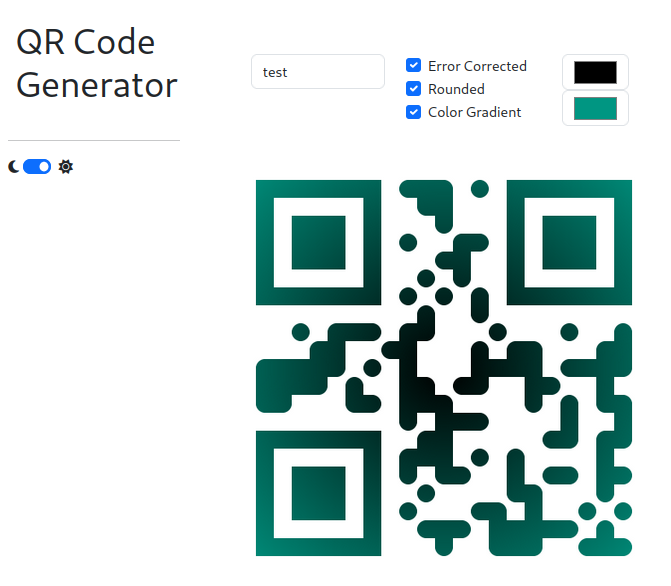

# QR Code Generator App

A simple [Dash](https://dash.plotly.com/) app to generate QR codes using the [python qrcode module](https://pypi.org/project/qrcode/).

## Getting started

Head to this [demo site](https://32b90066-d4c4-443e-9800-8058274e920d.ka.bw-cloud-instance.org/) for playing around.
Or start locally:

1. Clone/ download
2. `poetry install`
3. `poetry run python app/app.py`

Everything else should be self-explainatory.
